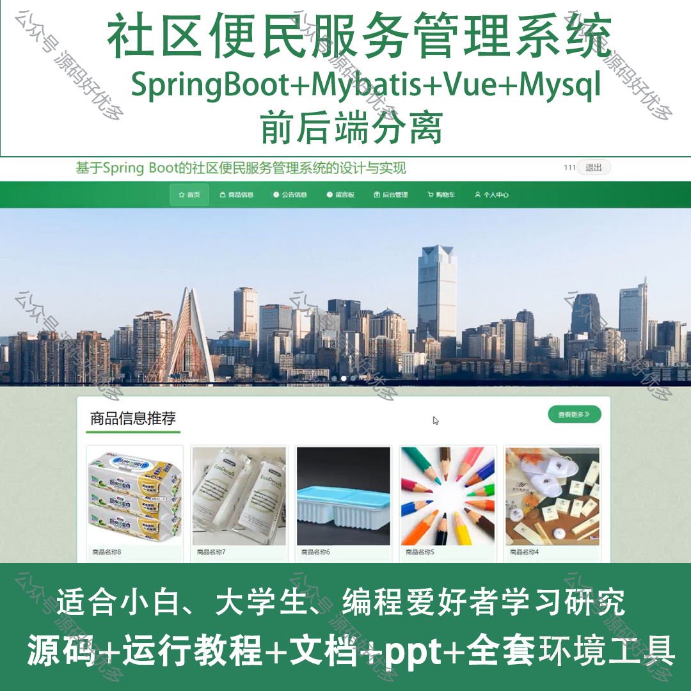
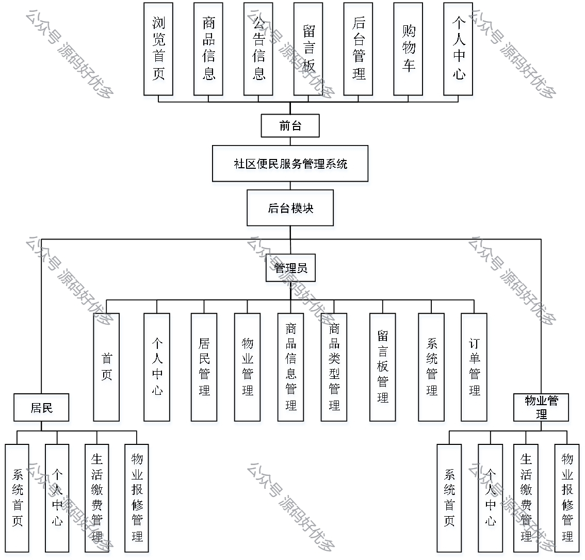
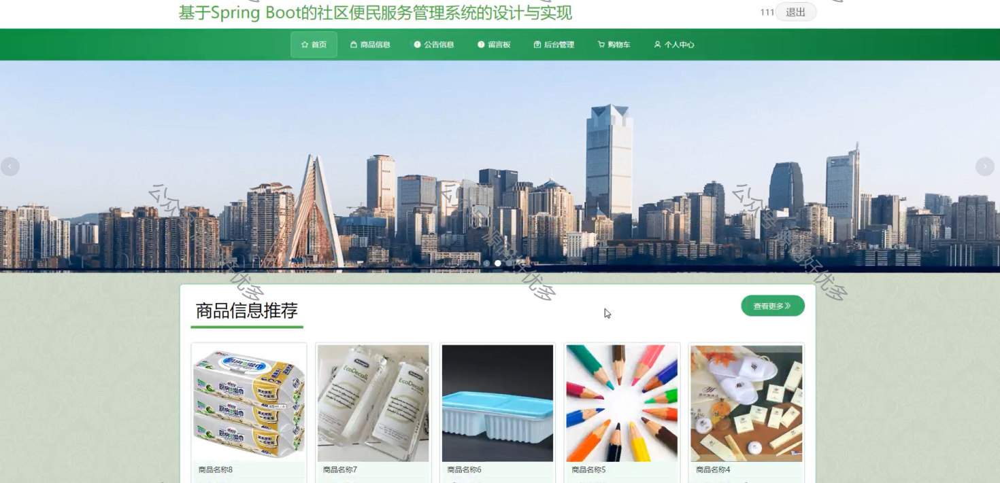
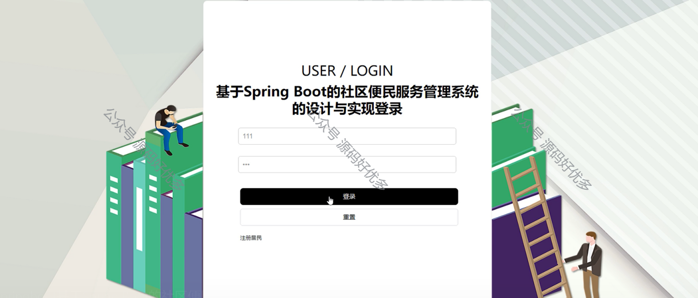
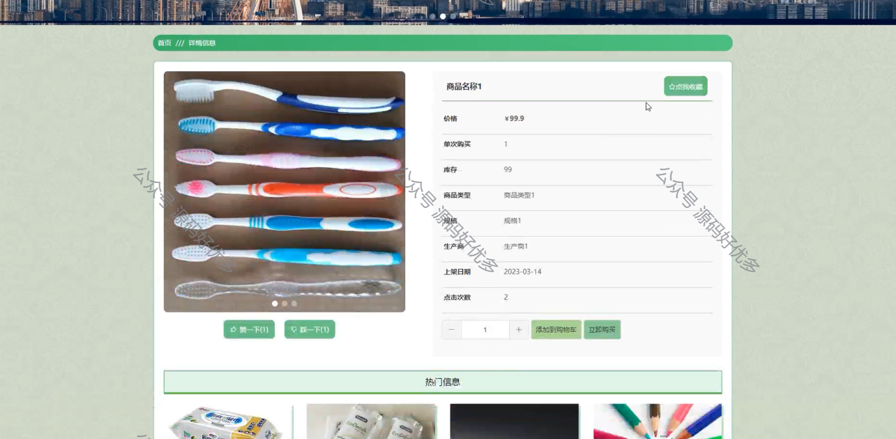
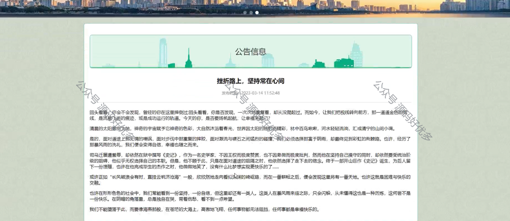
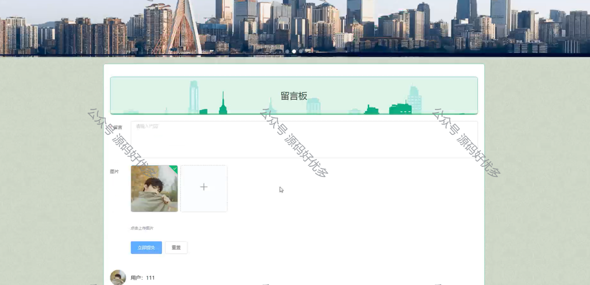
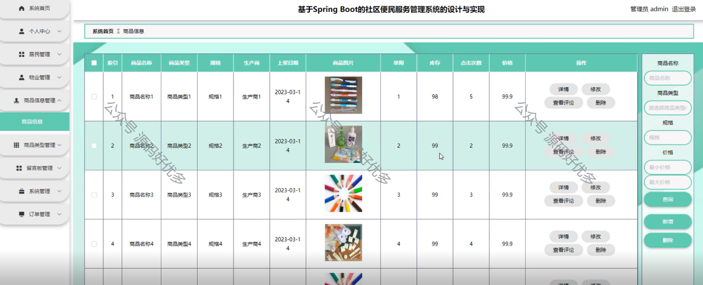
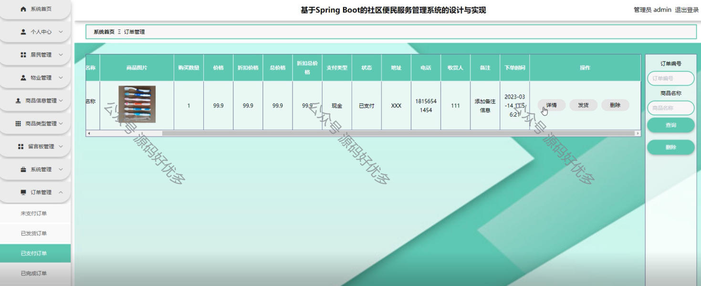
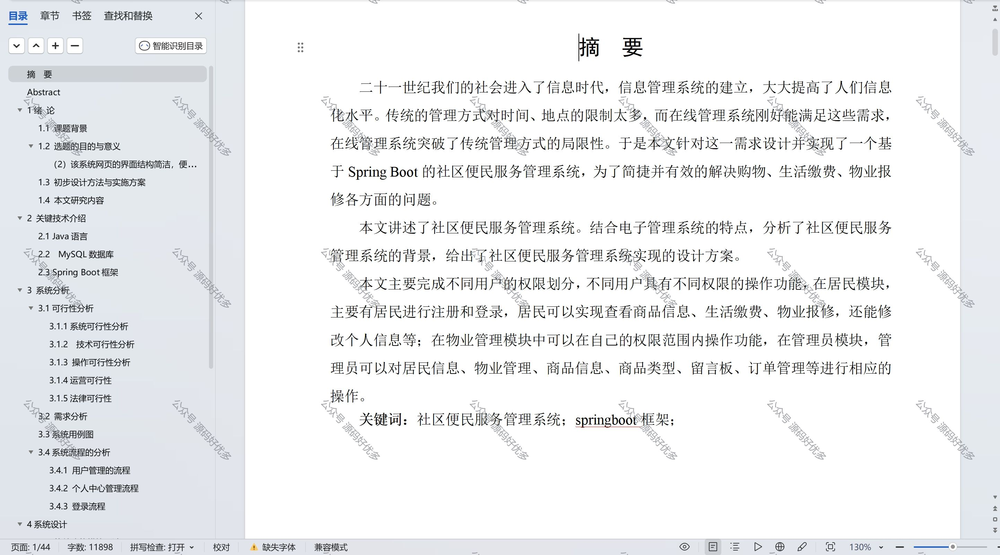

 
## 查看主页获取源码

> **作者介绍**： **✌**全网粉丝10W+本平台特邀作者、博客专家、CSDN新星计划导师、java领域优质创作者,博客之星、掘金/华为云/阿里云/InfoQ等平台优质作者、专注于项目实战 **✌**

  

### 一、作品包含

源码+数据库+设计文档万字+PPT+全套环境和工具资源+部署教程

### 二、项目技术

前端技术：Html、Css、Js、Vue、Element-ui

数据库：MySQL

后端技术：Java、Spring Boot、MyBatis

  

### 三、运行环境

开发工具：IDEA/eclipse

数据库：MySQL5.7

数据库管理工具：Navicat10以上版本

环境配置软件： JDK1.8+Maven3.6.3

前端Nodejs：14

### 四、项目介绍
项目编号：springbootA126

社区便民服务管理系统是为了提升社区居民的生活质量，方便居民获取各种服务而设计的，旨在通过信息化手段实现社区服务的便捷化、高效化，增强社区服务的透明度，促进社区居民与社区管理者之间的互动，构建和谐社区环境。

前台居民功能：浏览首页、商品信息、公告信息、留言板、后台管理和购物车和个人中心。

后台分为管理员、居民、物业
管理员的功能：首页、个人中心、居民管理、物业管理、商品信息管理、商品类型管理、留言板管理、系统管理和订单管理页面。
居民的功能：系统首页、个人中心、生活缴费管理、物业报修管理
物业的功能：系统首页、个人中心、生活缴费管理、物业报修管理

### 五、运行截图

  
